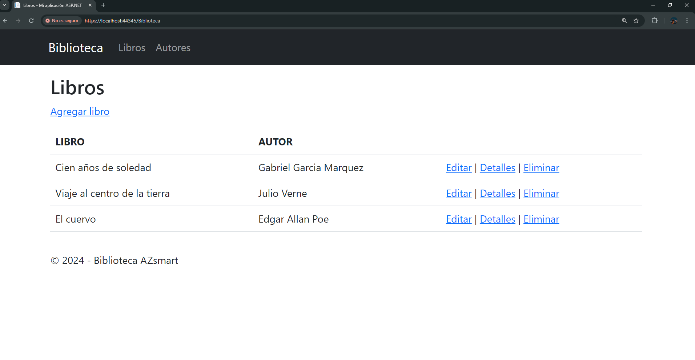
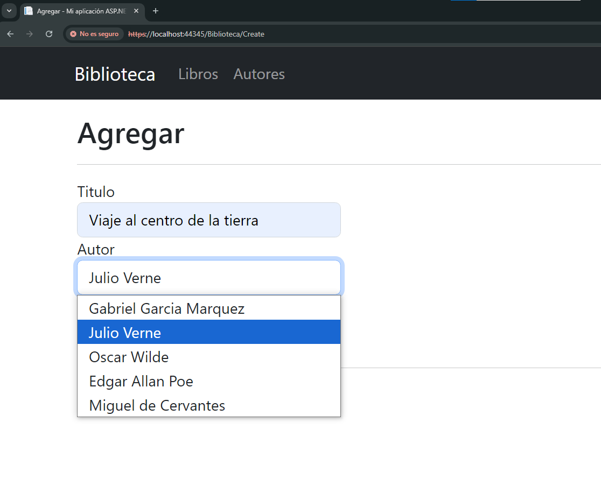
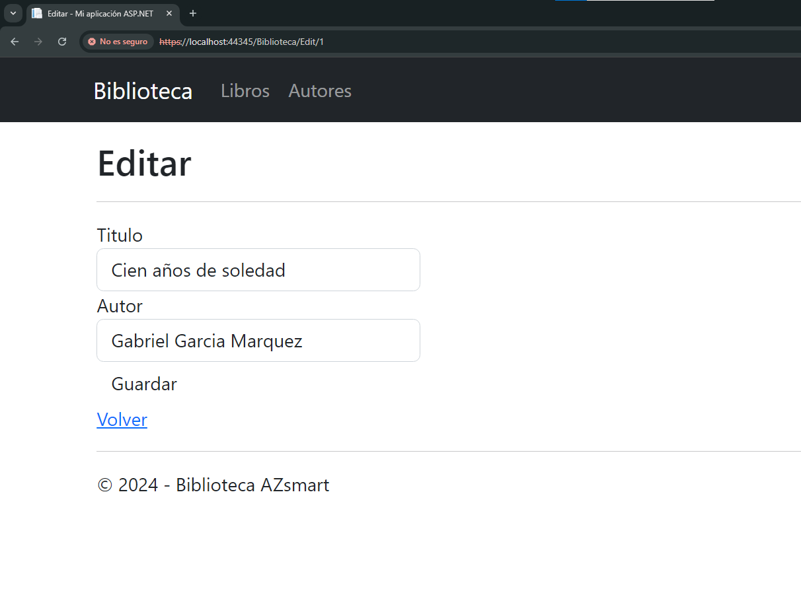
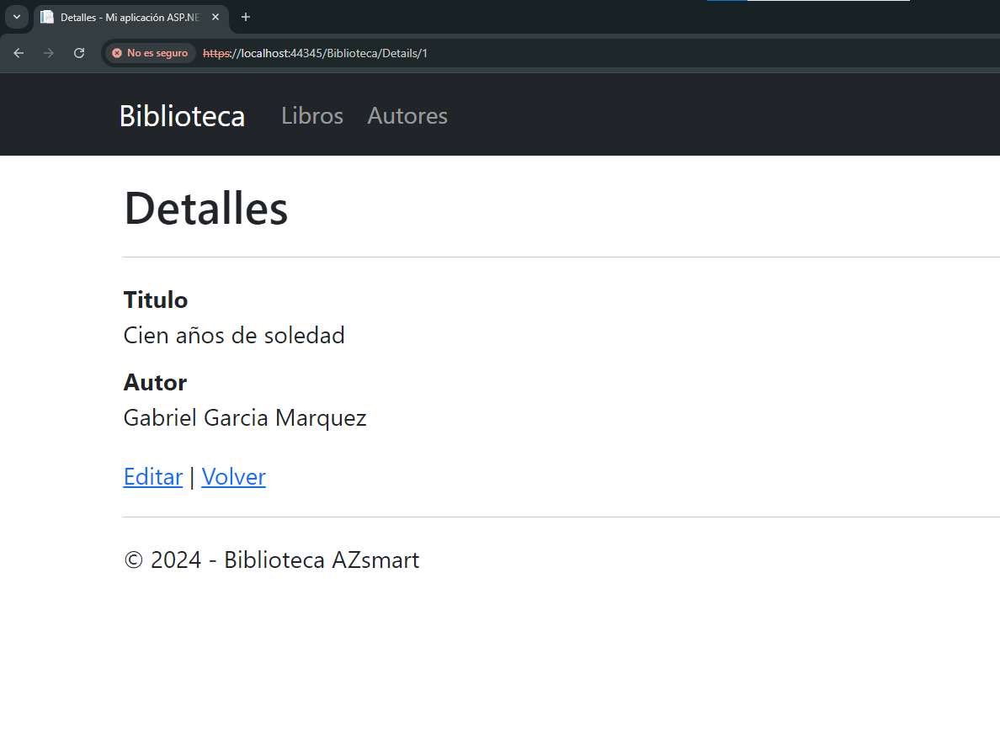
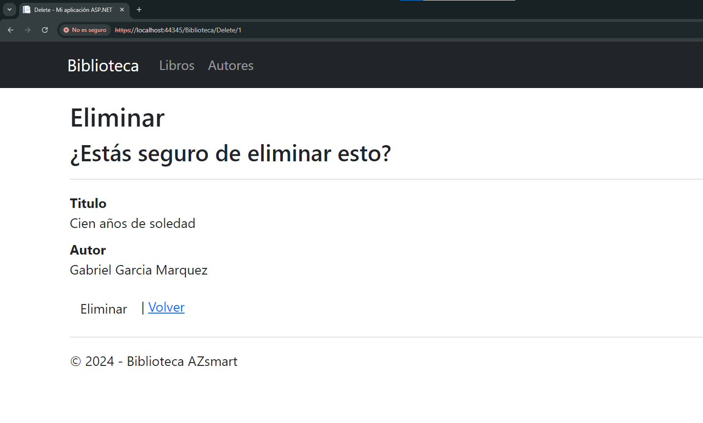
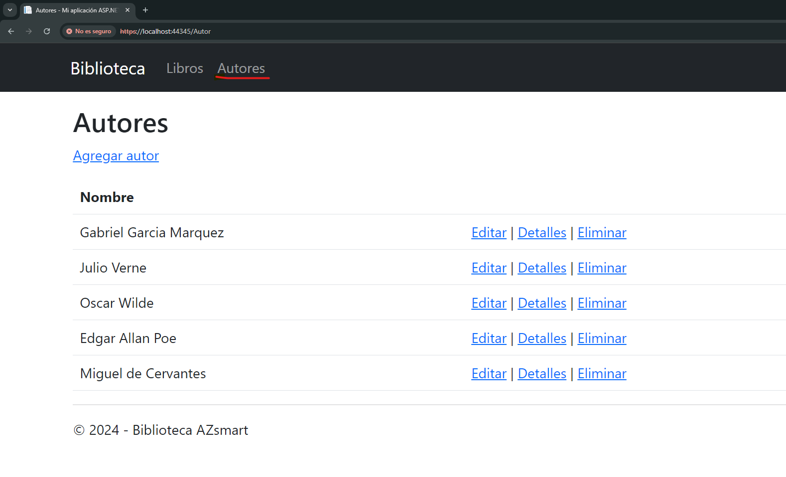
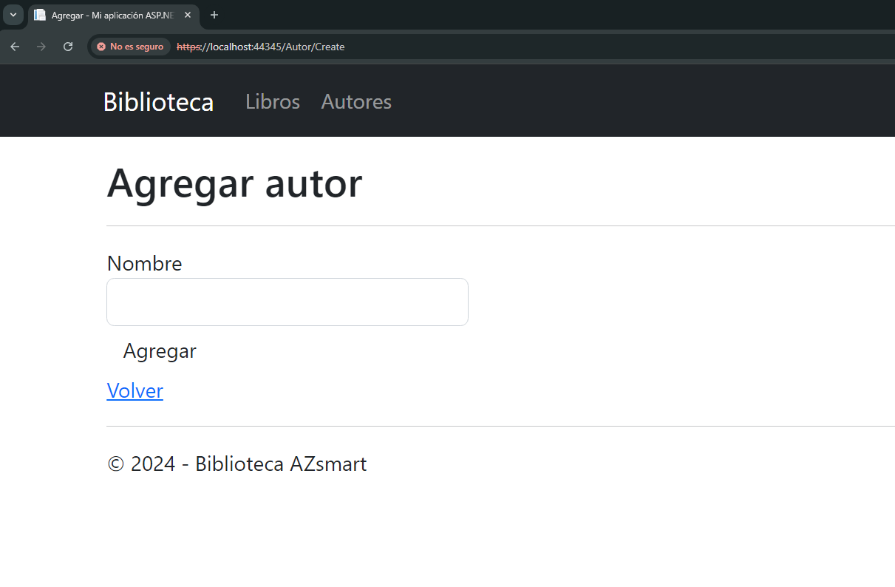
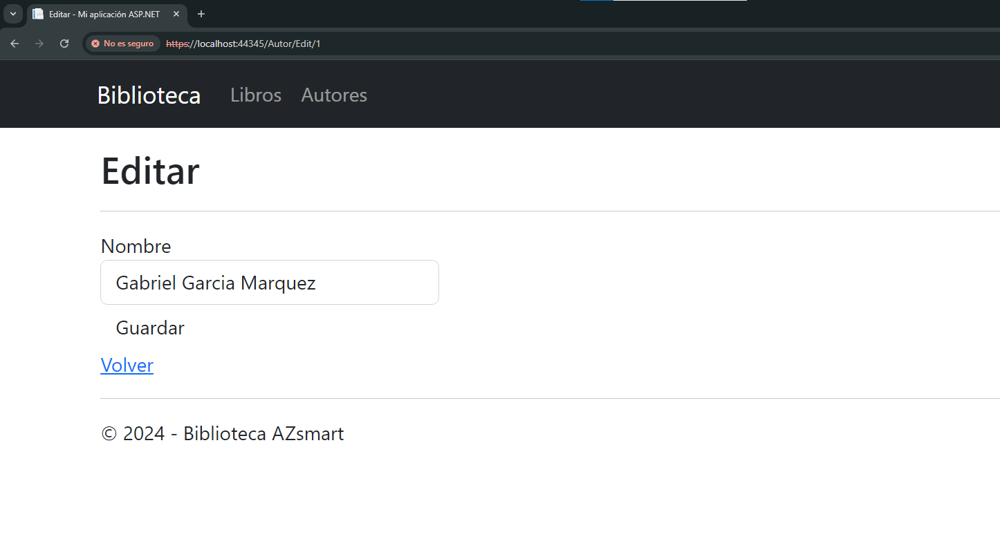
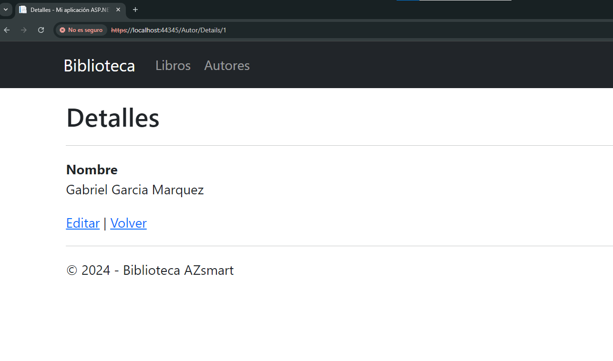
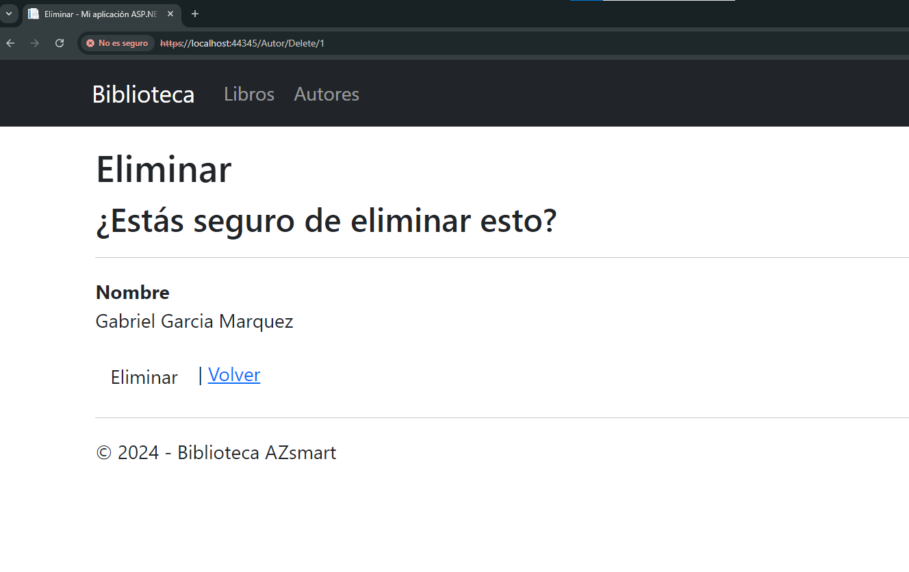

# azsmart

### Descripcion

Aplicación web simplificada de gestión de biblioteca utilizando ASP.NET MVC que permite a los usuarios ver, agregar, eliminar, editar libros y autores. Ademas de cumplir las mismas funciones crud con los autores.  
Se ha utilizado ASP.NET MVC con C#, Base de datos: SQL Server, conexion a base de datos por entity framework.

---

### Script

- Creacion de base de datos para software az.

      CREATE database AZsmart;

- Creacion de permisos de usuario de aplicacion 'TENER EN CUENTA ESTAR SOBRE LA CONEXION SOBRE LA BASE DE DATOS CREADA'.

      CREATE LOGIN softwareAZ
      WITH PASSWORD = 'accesolibreria';

- Asignacion de permisos para la base de datos AZsmart.

      USE AZsmart;
      CREATE USER softwareAZ FOR LOGIN softwareAZ;

- Asignacion de permisos para creacion de tablas sobre usuario softwareAZ.

      ALTER SERVER ROLE sysadmin 
      ADD MEMBER softwareAZ;

- Creacion de MER para el uso de la aplicacion.

Crear la tabla Autores.

		  CREATE TABLE Autores (
			id INT IDENTITY(1,1) PRIMARY KEY,
			nombre NVARCHAR(100) NOT NULL
		);

Crear la tabla Biblioteca.

		CREATE TABLE Biblioteca (
			id INT IDENTITY(1,1) PRIMARY KEY,
			titulo NVARCHAR(255) NOT NULL,
			autor_id INT NOT NULL,
			FOREIGN KEY (autor_id) REFERENCES Autores(id)
		);

- Se inserta autores.

      INSERT INTO Autores(nombre)
      VALUES ('Gabriel garcia marquez'),
           ('Julio Verne'),
           ('Oscar Wilde'),
           ('Edgar Allan poe');

- Se inserta libro.

      INSERT INTO Biblioteca(titulo, autor_id)
      VALUES ('Cien años de soledad', 1),
           ('Viaje al centro de la tierra', 2),
           ('Oscar Wilde', 3 ),
           ('El cuervo', 4);

---

### Pasos para configurar y ejecutar la aplicación.

#### 1. Clonar el repositorio
Clona el repositorio en tu máquina local usando Git:
#### 2. Configurar la base de datos
Asegúrate de que SQL Server está ejecutándose en tu máquina o en un servidor accesible.
Crea una nueva base de datos en SQL Server
#### 3. Configurar la cadena de conexión
Edita el archivo appsettings.json (para .NET Core) o Web.config (para .NET Framework) y ajusta la cadena de conexión para tu base de datos:
#### 4. Ejecutar la aplicación

### Funcionalidades
#### Seccion Libros
1. Listar libros agregados.
   

2. Agregar Libros.
   

3. Editar Libro.

4. Detalles de los Libros.

5. Eliminar Libro.

#### Seccion Autores

1. Lista de Autores.

2. Agregar Autor. Los autores que se agreguen seran los predeterminados para agregar un libro.

3. Editar Autor.

4. Detalles de Autores.

5. Eliminar Autores.

